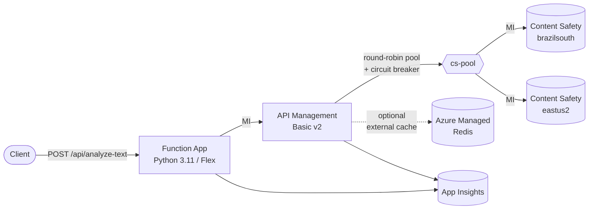

# apim-lb-content-safety

[](LICENSE)
[](.github/workflows/validate.yml)
[](.github/workflows/test.yml)

Production-grade `azd` template that load-balances **two Azure AI Content
Safety accounts** (Brazil South + East US 2 by default) behind **API
Management** with managed-identity auth, retries, circuit breakers, blocklist
pinning, and an Idempotency-Key contract on mutations.

Modeled after [`apim-lb-speech-service`](https://github.com/seilorjunior/apim-lb-speech-service)
but adapted for the Content Safety surface (Text + Image + Groundedness +
Protected Material + Prompt Shields + Blocklists).

## Architecture



Why a Function App in front of APIM?

- Mirrors the upstream speech template's layout so the muscle memory carries
  over.
- Lets you add request shaping, fan-out, or domain-specific validation in
  Python without amending policy XML.
- The Function is deliberately **thin** — APIM is the source of truth for
  load-balancing, retries, idempotency, and blocklist pinning.

## What lives where

```text
apim-lb-content-safety/
├── azure.yaml                       # azd descriptor (service "api" → src/api)
├── infra/
│   ├── main.bicep                   # subscription-scope entry
│   ├── main-resources.bicep         # RG-scope orchestrator
│   ├── main.parameters.json         # azd env-var bindings
│   └── modules/
│       ├── monitoring.bicep         # Log Analytics + App Insights
│       ├── storage.bicep            # MI-only blob (deployment package)
│       ├── contentsafety.bicep      # ONE module deployed twice (pri/sec)
│       ├── keyvault.bicep           # RBAC-only KV (Redis cs string)
│       ├── redis.bicep              # opt-in Azure Managed Redis (Balanced_B0)
│       ├── apim.bicep               # APIM Basic v2 + named values + API + ops
│       ├── function.bicep           # FC1 Linux Python 3.11
│       ├── rbac.bicep               # MI role assignments
│       └── policies/
│           ├── api-base.xml             # round-robin pool + MI auth + retry
│           ├── stateless.xml            # no pinning (analyze, list-blocklists)
│           ├── blocklist-pin-read.xml   # cs-blocklist-{name} → backend
│           ├── blocklist-pin-write.xml  # (reserved for future)
│           └── idempotent-mutation.xml  # full Idempotency-Key contract
├── src/api/                         # Python Function App
│   ├── function_app.py              # 14 routes, all proxy to APIM
│   ├── host.json
│   ├── requirements.txt
│   ├── requirements-dev.txt
│   ├── pyproject.toml               # ruff + pytest + bandit + coverage
│   ├── local.settings.json.example
│   └── tests/                       # pytest + respx (offline)
├── scripts/
│   ├── postprovision.ps1            # azd hook — prints URLs
│   ├── test-deployment.ps1          # smoke test (+optional -Blocklists)
│   └── load-test.ps1                # parallel load + KQL hint
└── .github/
    ├── workflows/{validate,test}.yml
    ├── dependabot.yml
    ├── ISSUE_TEMPLATE/
    └── PULL_REQUEST_TEMPLATE.md
```

## Prerequisites

- [Azure Developer CLI](https://learn.microsoft.com/azure/developer/azure-developer-cli/install-azd) (≥ 1.10)
- [Azure CLI](https://learn.microsoft.com/cli/azure/install-azure-cli) (≥ 2.62)
- [Bicep](https://learn.microsoft.com/azure/azure-resource-manager/bicep/install) (`az bicep install`)
- [PowerShell 7+](https://learn.microsoft.com/powershell/scripting/install/installing-powershell)
- Python 3.11 (only for local Function debugging)
- An Azure subscription with quota for **Content Safety S0** in both regions
  (default: `brazilsouth` and `eastus2`)

## Deploy

```pwsh
azd auth login
azd init
azd env set AZURE_LOCATION                 brazilsouth
azd env set SECONDARY_CONTENT_SAFETY_LOCATION eastus2
# Optional knobs:
azd env set AZURE_USE_EXTERNAL_CACHE       false           # true → Azure Managed Redis
azd env set IDEMPOTENCY_TTL_SECONDS        3600            # 60..604800
azd env set USE_PRODUCTION_GUARDS          false           # true → KV purge protection
azd up
```

The `postprovision` hook prints the Function URL, the APIM gateway URL, and
the names of both Content Safety accounts. To re-print them later:

```pwsh
pwsh ./scripts/postprovision.ps1
```

## Smoke test

```pwsh
pwsh ./scripts/test-deployment.ps1
pwsh ./scripts/test-deployment.ps1 -Blocklists      # exercise blocklist CRUD + idempotency replay
pwsh ./scripts/load-test.ps1 -Count 200 -Concurrency 25
```

To verify round-robin distribution, run this KQL against the App Insights
workspace:

```kusto
requests
| where timestamp > ago(15m) and operation_Name contains "analyze-text"
| extend backend = tostring(customDimensions["Backend service URL"])
| summarize count() by backend
```

A healthy split is roughly 50/50.

## Idempotency contract (mutations)

Implemented in `infra/modules/policies/idempotent-mutation.xml`. Applied to:

- `PATCH /api/blocklists/{name}` (upsert)
- `POST  /api/blocklists/{name}/items:add` (add or update items)
- `POST  /api/blocklists/{name}/items:remove`

Behaviour, in order:

| Condition | Status | Response |
| --- | --- | --- |
| `Idempotency-Key` absent | (passthrough) | Forward without caching |
| Key fails `^[A-Za-z0-9._-]{1,128}$` | `400 InvalidIdempotencyKey` | JSON error |
| Hash hit + same body | `201` | Cached body + `X-Idempotent-Replay: true` + `Location` |
| Hash hit + different body | `422 IdempotencyKeyConflict` | JSON error |
| In-flight sentinel exists | `409 IdempotencyInFlight` | `Retry-After: 5` |
| Otherwise | (forward) | Caches body, location, then hash on 2xx |

TTL is governed by the named value `idempotency-ttl-seconds` (default 3600 s,
range 60–604800). The hash is written **last** so a hash hit guarantees the
body is also present.

## Notes & limitations

- **Blocklist replication is your responsibility.** APIM pins `{name} →
  backend` *after* the first successful PATCH. If you want a blocklist
  available on both accounts, create it twice (one targeted call per backend
  via direct CS auth) — APIM does not replicate data plane state across
  accounts.
- **`GET /api/blocklists` round-robins.** Listings will show only the
  blocklists owned by whichever backend handled the call. The pin cache
  only covers `{name}`-scoped operations.
- **APIM Basic v2** does not include a built-in external cache. The internal
  cache works for single-instance scenarios; for HA across multiple gateway
  units, set `AZURE_USE_EXTERNAL_CACHE=true` to provision Azure Managed
  Redis (Balanced_B0 ≈ $40/mo) and bind it as the external cache.
- **Function auth is `anonymous`** to keep the smoke tests simple. Tighten
  this for production: switch to `function`, add `Easy Auth`, or front it
  with another APIM API.
- **Quotas**: Content Safety S0 has region-specific TPS limits. The retry
  policy (3× on 429/5xx with backoff) absorbs short bursts but does not
  replace upstream quota planning.
- **Region pair**: defaults are `brazilsouth` + `eastus2`. Override via
  `AZURE_LOCATION` and `SECONDARY_CONTENT_SAFETY_LOCATION`. Confirm the
  Content Safety SKU is GA in your chosen regions before deploying.

## Local development

```pwsh
cd src/api
python -m venv .venv
./.venv/Scripts/Activate.ps1
pip install -r requirements-dev.txt
cp local.settings.json.example local.settings.json   # then edit APIM_GATEWAY_URL
func start
```

Run the test suite (offline — APIM is mocked with `respx`):

```pwsh
pytest --cov=function_app --cov-report=term-missing
ruff check .
bandit -c pyproject.toml -r function_app.py
```

## Cost rough-cut (monthly, USD, list price)

| Resource | SKU | Approx. |
| --- | --- | --- |
| Content Safety × 2 | S0 (pay-per-call) | usage-based |
| API Management | Basic v2 | ~$170 |
| Function App | Flex Consumption (FC1) | ~$0–$15 (idle) |
| Storage | Standard_LRS | ~$1 |
| Log Analytics + App Insights | PerGB2018 | usage-based |
| Key Vault | Standard | <$1 |
| Azure Managed Redis (optional) | Balanced_B0 | ~$40 |

Prices vary by region; this is a planning estimate, not a quote.

## Contributing

See [CONTRIBUTING.md](CONTRIBUTING.md) and [SECURITY.md](SECURITY.md). PRs run
the [validate](.github/workflows/validate.yml) (Bicep + policy XML +
markdownlint) and [test](.github/workflows/test.yml) (pytest + ruff + bandit)
workflows.

## License

[MIT](LICENSE).
