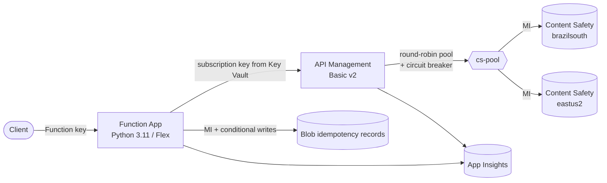

# apim-lb-content-safety

[](LICENSE)
[](.github/workflows/validate.yml)
[](.github/workflows/test.yml)

Reference `azd` template that load-balances **two Azure AI Content
Safety accounts** (Brazil South + East US 2 by default) behind **API
Management** with managed-identity backend auth, bounded read retries, circuit
breakers, deterministic blocklist ownership, and durable mutation idempotency.
Validate the deployed policies and failure scenarios in your environment before
production use; offline checks alone do not establish production readiness.

Modeled after [`apim-lb-speech-service`](https://github.com/seilorjunior/apim-lb-speech-service)
but adapted for the Content Safety surface (Text + Image + Groundedness +
Protected Material + Prompt Shields + Blocklists).

## Architecture


```mermaid
flowchart LR
    Caller([Client]) -->|"Function key"| Func[Function App<br/>Python 3.11 / Flex]
    Func -->|"subscription key from Key Vault"| APIM[API Management<br/>Basic v2]
    Func -->|"MI + conditional writes"| Storage[(Blob idempotency records)]
    APIM -->|round-robin pool<br/>+ circuit breaker| Pool{{cs-pool}}
    Pool -->|MI| CS1[(Content Safety<br/>brazilsouth)]
    Pool -->|MI| CS2[(Content Safety<br/>eastus2)]
    APIM --> AI[(App Insights)]
    Func --> AI
```

Why a Function App in front of APIM?

- Mirrors the upstream speech template's layout so the muscle memory carries
  over.
- Lets you add request shaping, fan-out, or domain-specific validation in
  Python without amending policy XML.
- The Function owns durable idempotency and query filtering. APIM owns
  load-balancing, the entire retry budget, and deterministic blocklist routing.
- All Function-key holders share one trust boundary; this is not tenant
  isolation. Use separately authenticated and isolated deployments for tenants.

## What lives where

```text
apim-lb-content-safety/
├── azure.yaml                       # azd descriptor (service "api" → src/api)
├── infra/
│   ├── main.bicep                   # subscription-scope entry
│   ├── main-resources.bicep         # RG-scope orchestrator
│   ├── main.parameters.json         # azd env-var bindings
│   └── modules/
│       ├── monitoring.bicep         # Log Analytics + App Insights
│       ├── storage.bicep            # MI-only blob (deployment + idempotency)
│       ├── contentsafety.bicep      # ONE module deployed twice (pri/sec)
│       ├── keyvault.bicep           # RBAC-only KV (Redis cs string)
│       ├── redis.bicep              # opt-in Azure Managed Redis (Balanced_B0)
│       ├── apim.bicep               # APIM Basic v2 + named values + API + ops
│       ├── function.bicep           # FC1 Linux Python 3.11
│       ├── rbac.bicep               # MI role assignments
│       └── policies/
│           ├── api-base.xml             # round-robin pool + MI auth + retry
│           ├── stateless.xml            # pool routing without state
│           ├── analyze-text.xml         # routes analyses using owned blocklists
│           └── blocklist-routing.xml    # SHA-256(name) → stable owner
├── src/api/                         # Python Function App
│   ├── function_app.py              # 14 routes, all proxy to APIM
│   ├── idempotency.py               # atomic claims and response envelopes
│   ├── host.json
│   ├── requirements.txt
│   ├── requirements-dev.txt
│   ├── pyproject.toml               # ruff + pytest + bandit + coverage
│   ├── local.settings.json.example
│   └── tests/                       # pytest + respx (offline)
├── scripts/
│   ├── postprovision.ps1            # azd hook — prints URLs
│   ├── test-deployment.ps1          # smoke test (+optional -Blocklists)
│   └── load-test.ps1                # parallel load + KQL hint
└── .github/
    ├── workflows/{validate,test}.yml
    ├── dependabot.yml
    ├── ISSUE_TEMPLATE/
    └── PULL_REQUEST_TEMPLATE.md
```

## Prerequisites

- [Azure Developer CLI](https://learn.microsoft.com/azure/developer/azure-developer-cli/install-azd) (≥ 1.10)
- [Azure CLI](https://learn.microsoft.com/cli/azure/install-azure-cli) (≥ 2.62)
- [Bicep](https://learn.microsoft.com/azure/azure-resource-manager/bicep/install) (`az bicep install`)
- [PowerShell 7+](https://learn.microsoft.com/powershell/scripting/install/installing-powershell)
- Python 3.11 (only for local Function debugging)
- An Azure subscription with quota for **Content Safety S0** in both regions
  (default: `brazilsouth` and `eastus2`)

## Deploy

```pwsh
azd auth login
azd init
azd env set AZURE_LOCATION                 brazilsouth
azd env set SECONDARY_CONTENT_SAFETY_LOCATION eastus2
# Optional knobs:
azd env set AZURE_USE_EXTERNAL_CACHE       false           # only needed for custom cache policies
azd env set IDEMPOTENCY_TTL_SECONDS        3600            # 60..604800
azd env set USE_PRODUCTION_GUARDS          false           # true → KV purge protection
azd up
```

The `postprovision` hook prints the Function URL, the APIM gateway URL, and
the names of both Content Safety accounts. To re-print them later:

```pwsh
pwsh ./scripts/postprovision.ps1
```

## Smoke test

```pwsh
pwsh ./scripts/test-deployment.ps1
pwsh ./scripts/test-deployment.ps1 -Blocklists      # exercise blocklist CRUD + idempotency replay
pwsh ./scripts/test-deployment.ps1 -Reliability    # concurrent mutations, replay fidelity, ownership
pwsh ./scripts/load-test.ps1 -Count 200 -Concurrency 25
```

Only in an isolated, disposable deployment, opt in to outage and cold-worker
checks:

```pwsh
pwsh ./scripts/test-deployment.ps1 -Reliability -FaultInjection -DisposableEnvironment -RestartFunction
```

This temporarily changes a backend path on its existing trusted origin, configures
its circuit breaker to trip on a 404, and restarts the Function. The script restores
the URL and breaker configuration in `finally`, but interruption or management-plane
failure can require manual restoration. It requires an observed fault and twelve
consecutive successful stateless calls, checks owner failure without stateful
rerouting, and verifies persisted replay after restart.
It does **not** flush Redis or APIM caches, prove circuit-breaker state, or prove
exact upstream dispatch counts; use gateway telemetry for those assertions.
No routing/idempotency policy depends on APIM caches. Run the suite with external
cache disabled to verify the cache-free deployment as well.

To verify round-robin distribution, run this KQL against the App Insights
workspace:

```kusto
requests
| where timestamp > ago(15m) and operation_Name contains "analyze-text"
| extend backend = tostring(customDimensions["Backend service URL"])
| summarize count() by backend
```

A healthy split is roughly 50/50.

## Idempotency contract (mutations)

Implemented in the Function (`src/api/idempotency.py`) using private Azure Blob
Storage and managed identity. Applied to non-read requests with an
`Idempotency-Key`, including:

- `PATCH /api/blocklists/{name}` (upsert)
- `POST  /api/blocklists/{name}/items:add` (add or update items)
- `POST  /api/blocklists/{name}/items:remove`

Behaviour, in order:

| Condition | Status | Response |
| --- | --- | --- |
| `Idempotency-Key` absent | (passthrough) | Forward without caching |
| Key fails `^[A-Za-z0-9._-]{1,128}$` | `400 InvalidIdempotencyKey` | JSON error |
| Completed record + matching fingerprint | Original status | Original body/headers + `X-Idempotent-Replay: true` |
| Same scoped key + different fingerprint | `422 IdempotencyKeyConflict` | JSON error |
| Pending operation | `409 IdempotencyInFlight` | `Retry-After: 5`; may require reconciliation |
| Storage unavailable | `503 IdempotencyUnavailable` | Fail closed; no uncoordinated forwarding |
| Otherwise | (forward once) | Atomically claims key, then stores one response envelope |

Keys are scoped by the Function credential boundary, APIM URL, HTTP method,
resource path, and API version. Fingerprints cover the body, supported query
parameters, and content-negotiation headers. Caller-supplied identity headers
do not create a trusted tenant scope. A different resource or operation may
reuse the same key without replaying an unrelated result.

Initial claims use conditional blob creation; reclaiming an expired completed
record and completing a claim require an ETag compare-and-swap. There is no
lookup-then-write cache lock or separately stored hash/body pair.
`IDEMPOTENCY_TTL_SECONDS` controls the completed-response replay window (default
3600 s, range 60–604800). After expiry, a new claim may execute again.

**Unknown outcomes do not expire automatically.** Pending records survive
worker termination. Transport failures, HTTP 202/408, and 5xx responses are
uncertain: if saved, their responses replay indefinitely; otherwise the pending
record returns 409. Reconcile the backend outcome before an operator deletes or
repairs such a record. Do not retry an uncertain mutation with a new key or
apply lifecycle deletion to the idempotency container. This deliberately favors
avoiding duplicate effects over automatic recovery; it is not an exactly-once
transaction with Content Safety. Definitive error responses also replay during
their TTL.

The Function consumes `Idempotency-Key`; APIM rejects the header on direct
gateway calls with `400 IdempotencyRequiresFunction`. Direct unkeyed APIM calls
have no durable replay contract.

## Notes & limitations

- **Blocklist ownership is deterministic.** The first byte of
  SHA-256(UTF-8(blocklist name)), modulo two, chooses primary (0) or secondary
  (1). Every named read, mutation, and delete uses that owner without a cache.
  Keep exact name spelling and the hash/account mapping stable.
- **No automatic stateful failover.** An unavailable owner returns an error,
  not a read/write against a potentially stale peer. Replication and recovery
  remain operator responsibilities. Text analysis with `blocklistNames` uses
  their owner; requests spanning both owners return `400 InvalidBlocklistRouting`
  and must be split explicitly.
- **`GET /api/blocklists` round-robins.** Listings will show only the
  blocklists owned by whichever backend handled the call, not a merged global
  inventory; listing pagination is not pinned to one account.
- **Redis is not required for correctness.** Neither blocklist routing nor
  idempotency depends on APIM caches. The optional Redis deployment is retained
  for custom policies; enabling it does not add replication or stronger guarantees.
- **Function auth is `function`**, including health. Prefer the
  `x-functions-key` header; `?code=` is accepted only at ingress and is not
  forwarded. Function → APIM uses a Key Vault-backed subscription key;
  APIM → Content Safety and Function → Blob Storage use managed identity.
- **Query forwarding is allowlisted.** Only supported paging parameters
  (`top`, `maxpagesize`, `skiptoken`) on list operations are forwarded.
  API versions are server-controlled; credentials and unknown parameters are dropped.
- **Quotas**: Content Safety S0 has region-specific TPS limits. The retry
  policy retries only GET/HEAD/OPTIONS on 429/5xx, at most four attempts with
  10-second per-attempt header timeouts and at most three 5-second backoffs.
  The Function never adds retries. POST/PATCH/DELETE get one 50-second header
  timeout attempt, with or without a key. The Function additionally enforces
  a 60-second total upstream deadline, including response-body transfer;
  storage coordination is outside that deadline. Callers must handle throttling explicitly;
  retries do not replace quota planning.
- **Region pair**: defaults are `brazilsouth` + `eastus2`. Override via
  `AZURE_LOCATION` and `SECONDARY_CONTENT_SAFETY_LOCATION`. Confirm the
  Content Safety SKU is GA in your chosen regions before deploying.

### Upgrading an existing deployment

Stop writes and drain in-flight requests before changing routing. Inventory and
migrate existing blocklists to their deterministic owners using direct Content
Safety access; old random pins are not imported. Preserve application references
to items during migration and verify each owned read and analysis before resuming.
Do not replay pre-upgrade idempotency keys against the new store: resolve their
outcomes and retire them first (old APIM cache records are not migrated).

Blob records contain response data; apply appropriate access controls and
retention procedures. Completed records are reclaimed on key reuse, not globally
garbage-collected; monitor storage growth. Never delete pending/uncertain records
without reconciliation.

## Local development

```pwsh
cd src/api
python -m venv .venv
./.venv/Scripts/Activate.ps1
pip install -r requirements-dev.txt
cp local.settings.json.example local.settings.json   # then edit APIM_GATEWAY_URL
func start
```

Run the test suite (offline — APIM is mocked with `respx`):

```pwsh
pytest --cov --cov-report=term-missing
ruff check .
bandit -c pyproject.toml -r .
```

## Cost rough-cut (monthly, USD, list price)

| Resource | SKU | Approx. |
| --- | --- | --- |
| Content Safety × 2 | S0 (pay-per-call) | usage-based |
| API Management | Basic v2 | ~$170 |
| Function App | Flex Consumption (FC1) | ~$0–$15 (idle) |
| Storage | Standard_LRS | ~$1 |
| Log Analytics + App Insights | PerGB2018 | usage-based |
| Key Vault | Standard | <$1 |
| Azure Managed Redis (optional) | Balanced_B0 | ~$40 |

Prices vary by region; this is a planning estimate, not a quote.

## Contributing

See [CONTRIBUTING.md](CONTRIBUTING.md) and [SECURITY.md](SECURITY.md). PRs run
the [validate](.github/workflows/validate.yml) (Bicep + policy XML +
markdownlint) and [test](.github/workflows/test.yml) (pytest + ruff + bandit)
workflows.

## License

[MIT](LICENSE).
